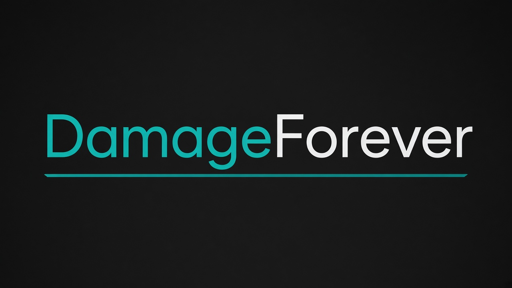
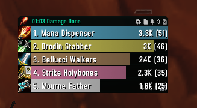
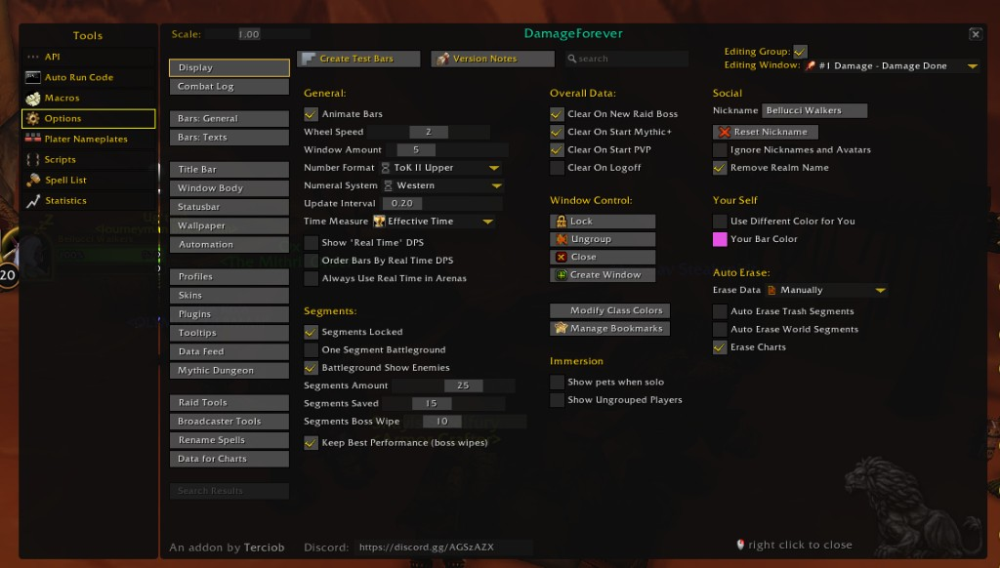

# Damage Meter Forever

  

Foofi damage meter for [WoW Classic Forever](https://worldofforever.com/).

Built on the [Details!](https://github.com/Tercioo/Details-Damage-Meter) core (Terciob), adapted for Forever’s secret API and **C_DamageMeter** (no combat-log parsing). Includes **ThreatForever**, a Foofi threat plugin for Details windows.

  

  

## Package contents

| Folder (keep these names) | Addon list title |
|---------------------------|------------------|
| `Details` | **Damage Meter Forever** |
| `Details_DataStorage` | **Damage Meter Forever: Storage** |
| `Details_TinyThreat` | **ThreatForever** |

Folder names must stay as above (WoW loads by folder / `.toc` name). Display titles are Foofi-branded.

## Install

Prefer the [release zip](https://github.com/gitBellucci/DamageForever/releases/latest). Do **not** use GitHub’s green **Code → Download ZIP** unless you keep the three folder names exact.

1. Extract so you have **`Details`**, **`Details_DataStorage`**, and **`Details_TinyThreat`**
2. Put them in `World of Warcraft\_classic_beta_\Interface\AddOns\`
3. Restart WoW (a `/reload` is not enough the first time)
4. Enable **Damage Meter Forever**, **Damage Meter Forever: Storage**, and **ThreatForever**

## Use

- Meter windows work like Details: drag, stretch, right-click for modes
- Gear icon → options · title **Damage Meter Forever**
- Mode / Plugins → **ThreatForever** for threat
- `/df` or `/details` — options / commands
- `/tf` — ThreatForever options

Default skin: **Damage Meter Forever** (Foofi teal chrome, class-colored bars).

## Forever notes

- Uses Blizzard `C_DamageMeter` (Forever / Midnight-style path)
- Secret-safe guards in LibOpenRaid and UI code
- Threat values are not Classic-Era `/100` scaled

## Credits

- **Details!** combat meter by [Terciob](https://github.com/Tercioo) — this package is a Forever-oriented port/skin, not an official Details! release
- **Damage Meter Forever / ThreatForever** branding and Forever adaptations by **Foofi**

## License

See `LICENSE`. Details! original code remains under its upstream license terms; Foofi additions and Forever packaging are provided under MIT where applicable.
